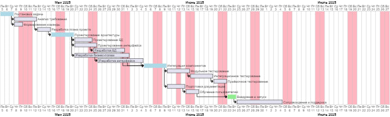

# План разработки InnoSport

## Основные этапы проекта

1. **Анализ требований и проектирование**
   - Сбор и анализ требований
   - Проектирование архитектуры приложения
   - Разработка UML-диаграмм

2. **Разработка базы данных**
   - Проектирование структуры БД
   - Создание моделей данных (Entity Framework Core)
   - Настройка миграций

3. **Реализация пользовательских ролей**
   - Обычный пользователь
   - Спортсмен
   - Тренер
   - Администратор
   - Главный администратор

4. **Разработка основных функций**
   - Регистрация и аутентификация пользователей
   - Управление пользователями и секциями
   - Ведение расписания тренировок
   - Отслеживание прогресса спортсменов
   - Работа с заявками и уведомлениями

5. **Тестирование**
   - Модульные тесты (xUnit)
   - Интеграционное тестирование
   - Ручное тестирование интерфейса

6. **Документирование и подготовка к релизу**
   - Оформление пользовательской и технической документации
   - Подготовка релизной сборки

---

## Диаграмма Ганта

---

## Примерный график выполнения

| Этап                          | Начало      | Окончание   | Ответственный      |
|-------------------------------|-------------|-------------|--------------------|
| Анализ требований             | 01.06.2025  | 03.06.2025  | Аналитик           |
| Проектирование архитектуры    | 04.06.2025  | 06.06.2025  | Архитектор         |
| Разработка БД                 | 07.06.2025  | 09.06.2025  | Разработчик БД     |
| Реализация ролей и функций    | 10.06.2025  | 20.06.2025  | Разработчик        |
| Тестирование                  | 21.06.2025  | 25.06.2025  | Тестировщик        |
| Документирование и релиз      | 26.06.2025  | 28.06.2025  | Вся команда        |

---

> Актуальные сроки и задачи могут корректироваться по ходу проекта.